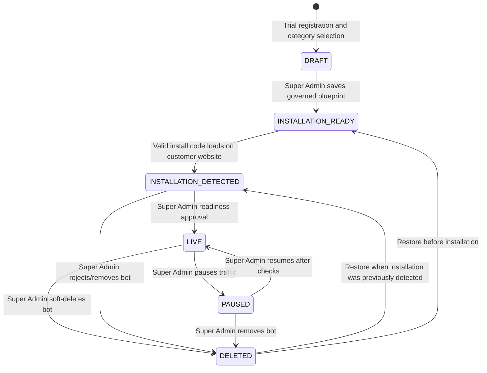

# AiFrogi Self-Service Website Bot Lifecycle

Last updated: 30 August 2026  
Status: Canonical execution specification

## Objective

Allow a business owner to select an AI Business Bot, start a controlled 30-day trial, prepare sovereign business intelligence, install the bot on a website and reach a verified live state without bypassing tenant isolation, human accountability or Super Admin safety approval.

## Roles

### Trial owner / Client Admin

- Selects the initial bot category during trial registration.
- Verifies workspace ownership through email activation.
- Completes business identity and approved intelligence.
- Receives tenant-specific JavaScript, iFrame and WordPress installation instructions.
- Installs the code and monitors activation status.
- Maintains approved knowledge, persona and day-to-day AI operations after launch.

### AiFrogi Super Admin

- Reviews and finalises the bot blueprint, channels, authority and safety boundaries.
- Sees when a valid tenant installation is detected.
- Verifies knowledge, human handover and first-response readiness.
- Explicitly changes the bot to `LIVE`.
- May `PAUSE`, soft-`DELETE`, `RESTORE` or make the bot live again.
- Every lifecycle change is written to onboarding activity history.

## State model

`DELETED` is deliberately recoverable. It disables service without destroying business knowledge, conversations or audit evidence.

## Installation contract

The preferred code is an asynchronous JavaScript loader generated for one property slug and installation key. The loader:

1. Calls the tenant-bound installation endpoint.
2. Records the first valid website origin and detection time.
3. Does not render the bot while approval is pending.
4. Loads the AiFrogi iframe only when the server returns `LIVE`.
5. Stops rendering when the bot is paused or deleted.

iFrame and WordPress instructions are provided as alternate presentation methods. JavaScript remains preferred because it gives activation detection and central lifecycle enforcement.

## Security and data rules

- Installation keys identify a public embed and are not passwords or operator credentials.
- Lifecycle mutation endpoints require authenticated Super Admin access.
- Public conversation service accepts only legacy-compatible `CONFIGURED` bots and new `LIVE` bots.
- Paused, deleted, draft and approval-pending bots cannot create visitor conversations.
- Conversation APIs remain workspace- and property-scoped.
- Trial expiry continues to pause paid actions at the subscription layer.
- Client code never contains OpenAI, database, Meta or provider credentials.

## Source of truth

- Database lifecycle: `prisma/schema.prisma`
- Lifecycle repository: `lib/repositories/onboarding-repository.ts`
- Public installation loader: `app/api/public/website-bot/[slug]/install/route.ts`
- Visitor iframe: `app/embed/[slug]/page.tsx`
- Super Admin actions: `app/api/admin/customers/[id]/route.ts`
- Client and Super Admin UI: `components/website-bot/website-bot-installation.tsx`
- Public installation guide: `app/install-ai-bot/page.tsx`

## Completion test

1. A new trial records the selected AI Bot category.
2. Saving the governed blueprint generates tenant-specific installation code.
3. Copying code alone does not make the bot public.
4. Loading valid code records `INSTALLATION_DETECTED`.
5. Super Admin cannot make the bot live before detection.
6. Super Admin makes the detected bot live and the script loads the iframe.
7. Pause and Delete stop new public AI Bot conversations.
8. Restore is recoverable and audit logged.
9. Existing compatible production bots remain operational during migration.
