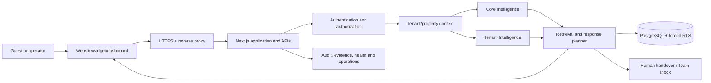
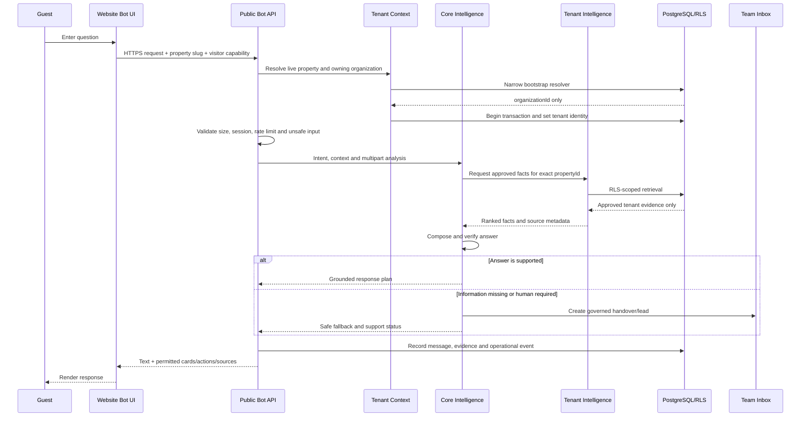
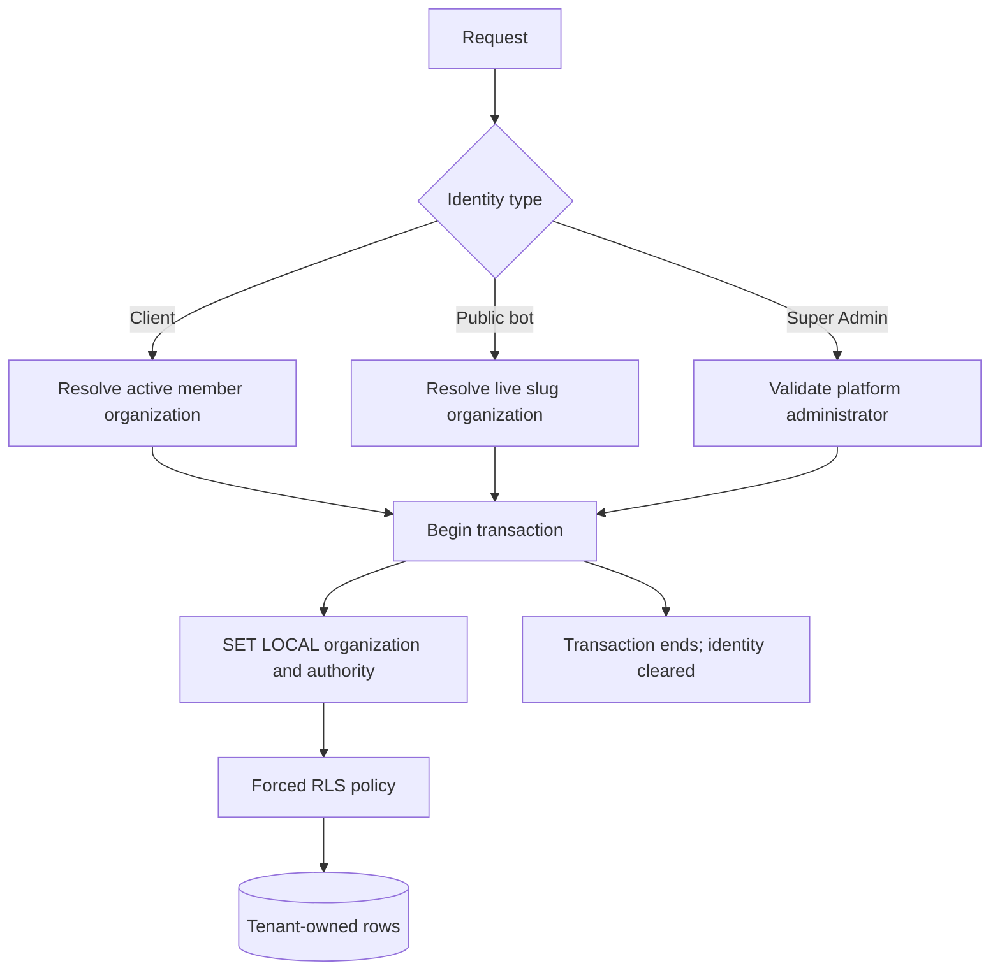
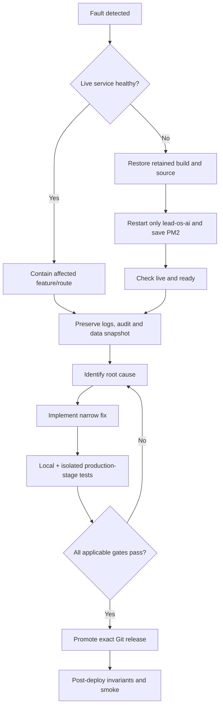

# AiFrogi System Architecture, Failure and Recovery Handbook

**Document status:** Management soft-release review

**Architecture style:** Multi-tenant Next.js modular monolith with PostgreSQL row-level security

**Current Core production release:** `d9a6b58`
**Last verified:** 23 September 2026 (IST)

This document explains how AiFrogi receives a visitor question, selects tenant-approved knowledge, generates a governed response, protects customer boundaries, records evidence, and recovers when a component fails. It is an engineering and management review document, not an external security certification or an accuracy guarantee.

## 1. Executive architecture

AiFrogi has two intelligence scopes:

1. **Core or Global Intelligence** understands intent, spelling mistakes, conversation context, multipart questions, privacy, safe refusal, handover and answer composition.
2. **Tenant or Bot Intelligence** supplies the approved facts for one organization and property, such as hotel identity, rooms, rates, policies, amenities, address and contact information.

Core Intelligence decides *how to answer*. Tenant Intelligence determines *which customer facts may be used*. A stable `organizationId` and `propertyId` join the two without mixing tenant information.

## 2. Layer breakdown

| Layer | Primary responsibility | Receives from | Sends to | Principal safeguard |
| --- | --- | --- | --- | --- |
| Experience | Marketing site, bot widget, standalone bot, dashboards | Browser/user | Next.js routes | HTTPS, safe rendering, no client secrets |
| Delivery | Domains, reverse proxy, PM2, application process | Internet | Next.js | TLS, health checks, controlled restart |
| Identity | Sessions, roles, membership, visitor capabilities | Request cookies/tokens | Access context | Signed sessions, expiry, revocation |
| Tenant context | Resolve organization/property/workspace | Identity and slug | Database and intelligence | Exact stable IDs; deny foreign workspace |
| Core Intelligence | Intent, context, decomposition, safety, response plan | Normalized question | Retrieval/action planner | Deterministic gates and regression banks |
| Tenant Intelligence | Approved property facts and workflows | Property ID and intent | Retrieval | Tenant ownership, approval status, freshness |
| Data access | Prisma and repositories | Application services | PostgreSQL | Explicit transaction-local identity |
| Database | System of record | Scoped queries | Scoped records | Forced PostgreSQL RLS and audit trail |
| Operations | Team Inbox, support, audit and Super Admin | Bot and staff events | Staff/client UI | Role checks, immutable evidence where applicable |
| Integration | Booking, payment and external connectors | Authorized plan | External provider | Credentials, signatures, idempotency, read-back |
| Delivery governance | GitHub, CI, Codex Security, deployment gates | Source changes | Verified release | Review, tests, exact commit, rollback |

## 3. Frontend-to-answer communication

The frontend never chooses tenant facts. It displays the server-authorized result. Booking, payment, contact capture and human handover cards are returned only when the server response plan permits them.

## 4. Tenant context and PostgreSQL RLS

`Organization` is the tenant boundary. `Property` is the operational workspace boundary. Records are directly or indirectly related to one of these identifiers.

The request flow is:

1. A narrow bootstrap function validates an exact session, member email, property slug or public bot slug.
2. The bootstrap function returns only an organization identifier; it does not return ordinary tenant rows.
3. The application starts a short database transaction.
4. PostgreSQL `set_config(..., true)` establishes `app.organization_id`, platform authority, security actor and system purpose for that transaction.
5. Forced RLS policies allow only matching organization/property records.
6. `SET LOCAL` semantics end with the transaction, preventing tenant identity from leaking through pooled connections.

`getBootstrapDb()` is reserved for narrow identity/readiness operations. `getProtectedDb()` is used where missing context must fail visibly. `getDb()` remains available during identity bootstrap; authenticated product surfaces must establish explicit client, public-bot, system or platform-admin context before protected reads.

## 5. Core and Tenant Intelligence pipeline

The answer pipeline follows:

`validate → understand → resolve tenant/property → retrieve → rank → compose → verify → respond → observe`

### Core Intelligence

- Normalizes spelling and common typing mistakes.
- Classifies identity, informational, commercial, booking, policy, sensitive and human-help intent.
- Reuses relevant conversation context without allowing unrelated context to override the current question.
- Splits multipart questions into answerable fields.
- Applies privacy and secret-detection rules.
- Chooses answer, clarification, safe refusal, connector action or human handover.
- Checks completeness before returning the response.

### Tenant Intelligence

- Resolves the exact `propertyId`.
- Retrieves only approved/published knowledge for that property.
- Uses tenant-specific aliases, entities, rooms, rates, capacity, policies and contact facts.
- Rejects unresolved conflicts and unpublished claims.
- Keeps workflow drafts separate from published flows.
- Supports tenant smoke and Golden certification banks.

### Response authority

The bot may describe approved information. It must not claim live availability, a completed booking, successful payment, cancellation or refund unless an authorized connector returns verifiable evidence. Missing evidence results in a bounded fallback or handover, not invention.

## 6. Data movement

| Data | Origin | Processing | Storage/destination | Boundary |
| --- | --- | --- | --- | --- |
| Guest question | Widget/standalone UI | Validation, intent, retrieval | Conversation/message/evidence | Visitor capability + tenant RLS |
| Approved knowledge | Client/Admin Intelligence | Review and publication | Knowledge tables/files | Property ownership and status |
| Bot answer | Core + tenant evidence | Composition and safety check | Message/evidence; returned to UI | Exact property context |
| Contact details | Guest with consent | Validation and qualification | Lead/customer record | Consent and tenant RLS |
| Human reply | Authorized operator | Conversation lock and ownership | LeadMessage/conversation | Role and tenant checks |
| Subscription/credits | Billing/payment operations | Signature and ledger rules | Subscription/credit ledger | Organization boundary and audit |
| Connector credential | Client/Admin setup | Encrypt, rotate, revoke | Credential store | Never returned to browser |
| Audit event | Application action | Structured evidence | Audit/activity records | Actor, tenant and timestamp |
| Release metadata | GitHub/deployment | Build and promotion | PM2 env, health endpoint, rollback | Exact commit identifier |

## 7. Security architecture

Security is layered rather than dependent on one control:

- HTTPS protects network transport.
- Signed sessions and visitor capabilities authenticate the caller.
- Server-side role checks authorize actions.
- Stable organization/property identifiers establish tenancy.
- Forced PostgreSQL RLS provides database-level isolation.
- Transaction-local identity prevents pool contamination.
- Input length, schema, origin and rate controls reduce abuse.
- Password, OTP, card-like and secret content is withheld from AI/storage paths where required.
- Connector credentials are encrypted, rotated, expiry-aware and revocable.
- Payment and webhook actions require provider signature verification.
- Idempotency prevents blind repetition of external writes.
- Audit records retain actor, action, target and outcome.
- TypeSafe is disabled and is not part of the live answer path.

Security readiness is not formal certification. External penetration testing and accredited ISO/SOC assurance remain separate activities.

## 8. VPS, GitHub and Codex Security roles

| System | Role | Not responsible for |
| --- | --- | --- |
| Core VPS `187.77.188.146` | Next.js runtime, PM2, public bots, dashboards, Core APIs, database connectivity, logs, builds and rollback | AI Readiness service ownership |
| AI Readiness VPS `187.77.191.216` | Separate readiness product/runtime and explicitly approved contracts | Implicit Core data, payment or connector authority |
| PostgreSQL | Durable business records, RLS enforcement and transactional integrity | Browser rendering or source governance |
| GitHub | Canonical source, commit history, review and CI | Live request processing |
| Codex Security | Development-time scanning, threat analysis, finding validation and patch review | Runtime firewall, live answer judge or external certification |

GitHub CI runs TypeScript, lint, tests, production build, client-secret checks and the authenticated database-context guard. The production health endpoint reports the promoted Git release. This connects source review to runtime traceability.

Codex Security reduces pre-deployment risk through repository and diff analysis. It adds no latency to guest answers because it does not sit in the production request path.

## 9. Release gates

### Before promotion

1. Explicit deployment approval.
2. Disk usage below the 85% stop threshold.
3. Exact Git commit archived and checksum verified.
4. Pre-deployment database-count baseline captured.
5. Current source/build rollback retained.
6. Isolated production-stage build.
7. TypeScript and focused security/context tests.
8. Database-context source guard.
9. SEC-001 tenant/credential/owner checks.
10. Applicable Core and tenant certification gates, or a documented management exception limited to unrelated infrastructure recovery.

### After promotion

1. PM2 online and saved.
2. `/api/health/live` returns OK.
3. `/api/health/ready` validates database, session secret, public URL and webhook/inbound controls.
4. Public bot/embed smoke returns 200.
5. Authenticated routes redirect anonymous requests to login rather than exposing data.
6. Post-deployment counts do not decrease unexpectedly.
7. TypeSafe flags remain off.
8. Error log shows no new release error.

## 10. Failure catalogue and recovery

| Failure | Detection | User impact | Immediate response | Recovery proof |
| --- | --- | --- | --- | --- |
| Missing tenant context | Visible data-access error, logs, context guard | Dashboard/API unavailable; no foreign data | Stop promotion or rollback | Correct tenant wrapper; health and authenticated smoke |
| RLS returns empty data | Count invariant or empty dashboard | False zero/blank screen | Compare pre/post counts; inspect context | Counts equal/increase; records visible to correct tenant |
| Cross-tenant attempt | RLS/authorization denies | Request rejected | Record audit; investigate actor/session | Isolation test and no foreign rows returned |
| Database unavailable | Readiness 503 | Application operations unavailable | Do not promote; keep/restart healthy release | Readiness database check OK |
| Build failure | CI/stage build | No live impact when staged | Correct source; rebuild | Clean production build passes |
| PM2 crash/restart loop | PM2 status and unstable restart count | Service interruption | Revert `.next` and source; restart/save PM2 | Online, zero unstable restarts, health OK |
| Disk exhaustion | Deployment preflight (`df`) | Builds/backups may fail | Stop deployment; remove verified disposable artifacts | Usage below 85%, rollback space available |
| Stale source drift | Exact archive/typecheck failure | Wrong or obsolete code may ship | Rebuild stage from Git; carry only env/dependencies/uploads | Checksums and build match Git commit |
| Connector timeout/rejection | Provider status and audit | No confirmed external action | Keep status pending; retry/handover safely | Provider evidence/read-back |
| Payment signature failure | Verification endpoint | Payment not credited | Reject request; no ledger mutation | Valid signed provider event |
| AI/model failure | Exception/timeout/evaluation | Safe fallback or handover | Use approved evidence/fallback; never invent | Evidence record and regression replay |
| Knowledge gap/conflict | Retrieval/gap/flag records | Partial answer or handover | Client/Admin reviews and republishes | New revision and tenant certification |
| Security finding | CI/Codex Security/dependency gate | Release blocked by severity | Validate, remediate, review, retest | Finding closed with evidence |

## 11. Recovery runbook

Recovery principles:

- Roll back application source/build before considering destructive data changes.
- Never use a database restore merely to correct application behavior unless verified data corruption exists.
- Preserve the failing release, logs and baseline for investigation.
- Do not delete neutral/shadow records during a feature rollback.
- Restart only the AiFrogi PM2 process; do not disturb unrelated VPS services.
- Never overwrite `.env.local`, customer uploads or runtime data during source promotion.

## 12. September RLS incident example

The initial RLS/context recovery promotion introduced a global production exception for every database access without an existing identity. This was stricter than the runtime architecture allowed: health and authentication bootstrap must query narrowly before tenant identity exists. Readiness returned HTTP 500, and protected runtime paths logged `MissingDatabaseIdentityError`.

Response:

1. The post-deployment ready check caught the defect immediately.
2. The retained source and `.next` build restored release `9d4a451`.
3. Live/ready and the Asavaristays embed returned healthy responses.
4. The design was corrected: bootstrap/readiness use explicit bootstrap access, while protected authenticated surfaces use explicit tenant/admin wrappers and `getProtectedDb()` where missing context must be visible.
5. The AI-operations route received its own tenant boundary.
6. Release `d9a6b58` passed the production build, 32-surface context guard, SEC-001, database invariants, health and bot smoke.

The incident demonstrates why both fail-closed controls and a separate bootstrap boundary are necessary, and why post-promotion readiness is a mandatory rollback trigger.

## 13. Current verified state and open conditions

Verified for `d9a6b58`:

- Live and ready health are OK.
- PM2 is online with zero unstable restarts.
- Asavaristays embed returns 200.
- Database invariant: 5 non-demo organizations, 464 website conversations, 13 subscriptions and 2 credit transactions.
- Authenticated database-context guard covers 32 surfaces.
- Channel tests passed 245/245; production-hardening tests passed 128/128.
- SEC-001 found three live tenants, no invalid live connector credentials and no duplicate owner identities.
- TypeSafe is fully off.
- Rollback is retained at `/var/backups/aifrogi/rls-context-e089ff6-20260923`.

Open conditions:

- Golden tenant certification remains required for Asavaristays, Castle Mandawa and Webtechnosys AI Agency.
- The remaining seven customers in the first-ten commercial objective are not selected.
- Customer acceptance, staff handover drills, billing acceptance and sustained production monitoring remain separate from automated implementation evidence.
- External penetration testing and formal ISO/SOC certification are not complete.

## 14. Soft-release recommendation

**Recommendation: approve with conditions for an invitation-only, supervised soft release.**

Conditions before admitting each customer:

1. Named organization/property and accountable customer admin.
2. Approved tenant knowledge and current Golden question bank.
3. Named AiFrogi support owner and tested human handover.
4. Confirmed trial/subscription and credit state.
5. Standalone or website installation smoke test.
6. Customer acknowledgement of known connector and transactional boundaries.
7. Daily answer/gap/error review during the initial period.
8. Immediate rollback for health/readiness failure, cross-tenant evidence, repeated incorrect transactional claims, data-count regression or restart instability.

Management approval should authorize a bounded pilot, not a claim that all ten commercial launches, formal security assurance or universal answer accuracy are complete.

## 15. Ownership

| Role | Accountability |
| --- | --- |
| Management | Approve scope, risk acceptance and expansion criteria |
| Platform Administrator | Tenant onboarding, lifecycle, billing oversight and incident coordination |
| Engineering | Code, tests, RLS contexts, deployment and rollback |
| Security owner | Policy, findings, dependency review and incident evidence |
| Support owner | Handover, ticket response and customer communication |
| Customer Admin | Knowledge approval, tenant flows, staff access and acceptance |

## 16. Management sign-off

- Approved scope: ______________________________________
- Approved tenants/properties: __________________________
- Conditions accepted: __________________________________
- Support owner: ________________________________________
- Rollback authority: ____________________________________
- Review date: ___________________________________________
- Decision: Approve / Approve with conditions / Do not approve
- Name and signature: ____________________________________
