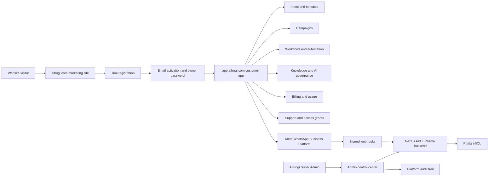
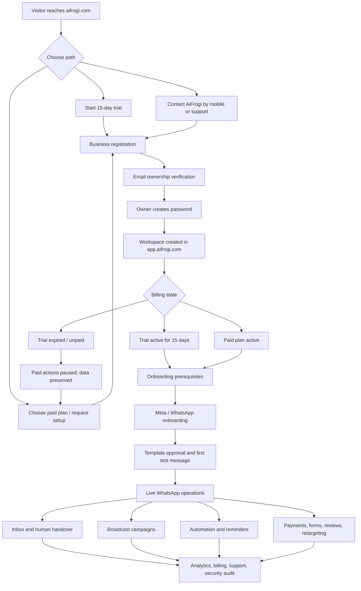
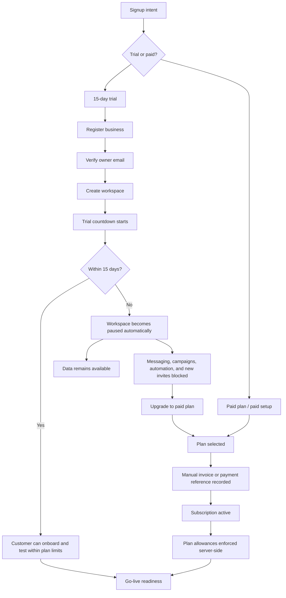
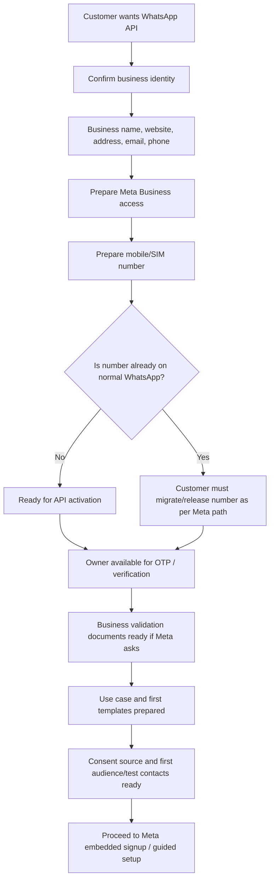
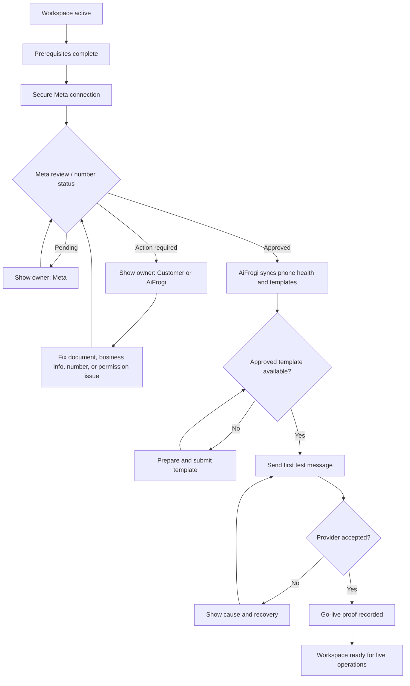
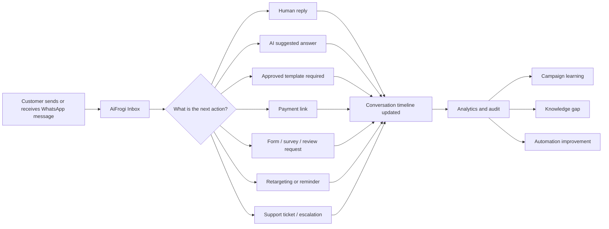
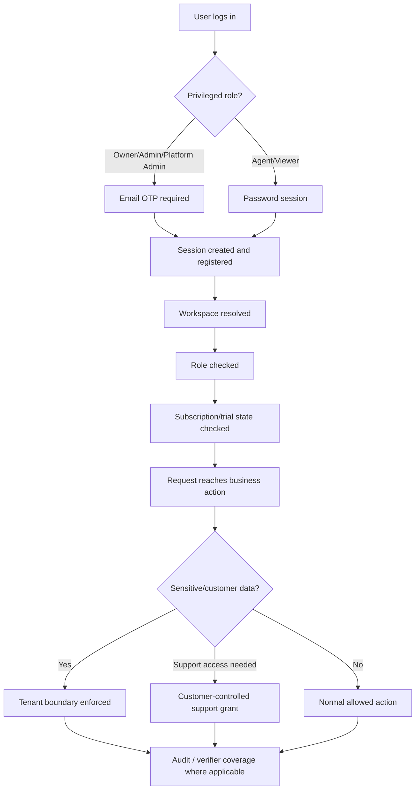
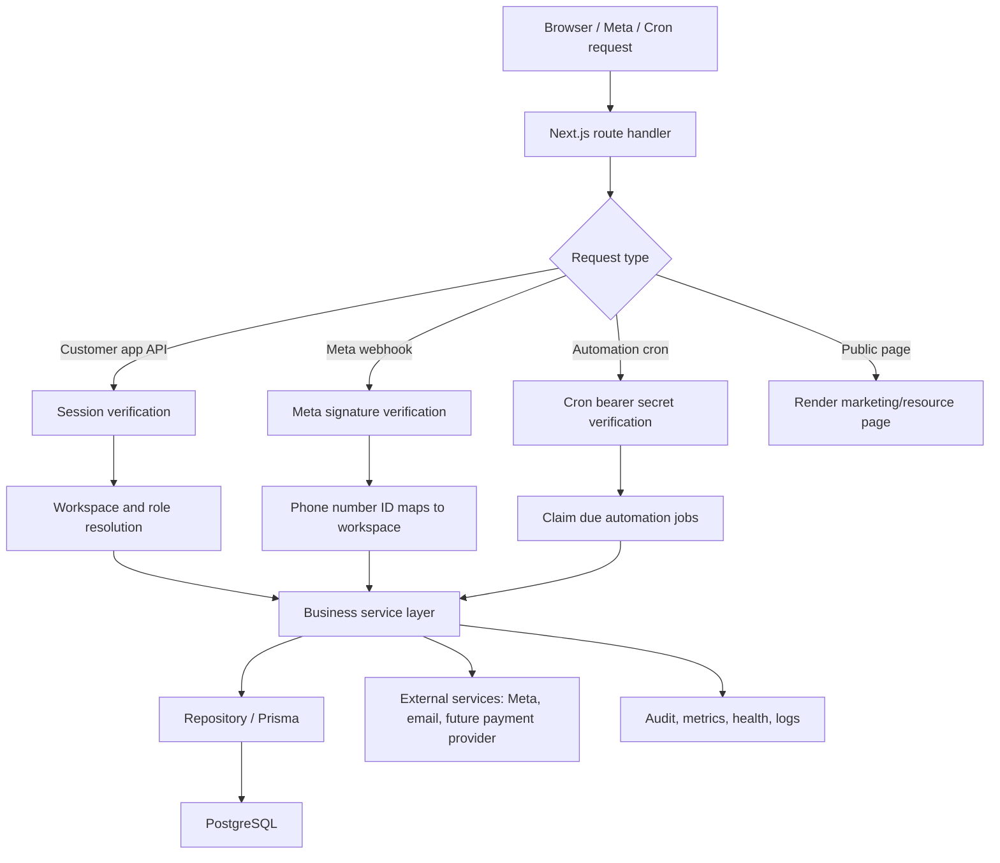
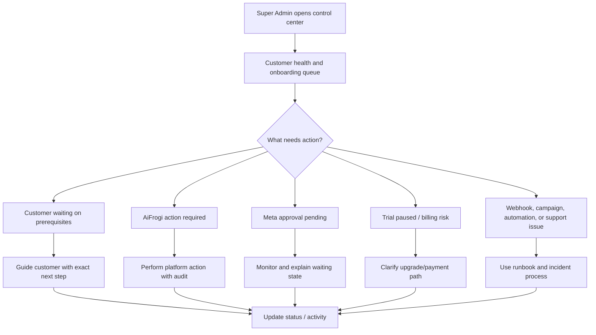

# AiFrogi Full Project Guidebook

Version: 2026-07-05  
Audience: Founder, product owner, developer, support operator, Super Admin, and future implementation partners

## 1. Purpose of this guidebook

This guidebook is the practical operating manual for AiFrogi. It explains what the product is, how the marketing site should speak, how the customer application works, how the backend is structured, how Super Admin should operate, and how security, billing, deployment, and verification should be handled.

It should be treated as a living document. When a new major feature, route, integration, or operating rule is added, update this guidebook or the linked runbook at the same time.

## 2. AiFrogi in one clear sentence

AiFrogi helps businesses run WhatsApp conversations, broadcasts, reminders, payments, forms, reviews, retargeting, and human-assisted AI workflows through the official WhatsApp Business Platform, with guided onboarding and controlled customer-data access.

AiFrogi's long-term product vision is to give every business a **sovereign business bot**: a bot that develops business-specific intelligence from approved first-party knowledge and consented interactions while preserving the business's ownership, history, portability, and control of its data. External AI models are governed processors, not the owner or permanent source of that intelligence.

The complete product and architecture principle is defined in [AiFrogi Sovereign Business Bot Vision](./AIFROGI_SOVEREIGN_BOT_VISION.md).

The product promise is not “AI will do everything.” The stronger and more honest promise is:

> AiFrogi turns WhatsApp customer conversations into the right next action, while keeping people, consent, billing, and data boundaries clear.

## 3. Non-negotiable product truths

These rules protect the brand and prevent confusion.

- Public product name is `AiFrogi`.
- Every AiFrogi bot must follow the sovereign-business-bot vision: business-owned intelligence, preserved data, tenant isolation, portability, and governed model use.
- Company/operator is `webtechnosys`.
- Old technical names like `LeadOS` or `lead-os-ai` are internal compatibility names only.
- Marketing site is [https://aifrogi.com](https://aifrogi.com).
- App site is [https://app.aifrogi.com](https://app.aifrogi.com).
- Production VPS path remains `/var/www/lead-os-ai`.
- Production PM2 process remains `lead-os-ai`.
- Trial is not free forever. Trial is 15 days only, then paid actions pause automatically.
- Meta charges and AiFrogi platform fees must stay separate.
- Never ask a customer for Facebook password, email password, OTP, permanent token, or app secret.
- Do not use fake logos, fake testimonials, or unsupported enterprise/security claims.
- Security claims must include the evidence boundary: “verified for covered controls/routes.”

## 4. System map



### 4.1 Overall business journey

This is the high-level customer journey AiFrogi should explain internally and publicly. It keeps the free-trial path, paid path, prerequisites, onboarding, and live operations connected as one system.



Plain-English version:

1. Customer discovers AiFrogi.
2. Customer starts a 15-day trial, selects paid setup, or contacts AiFrogi.
3. AiFrogi verifies email ownership and creates the workspace.
4. Trial or paid entitlement controls what actions are allowed.
5. Customer completes prerequisites.
6. AiFrogi guides Meta/WhatsApp activation.
7. Approved templates and first test message prove go-live.
8. Customer starts using Inbox, campaigns, automation, reminders, payments, forms, reviews, and retargeting.

### 4.2 Trial vs paid signup flow

The product must be very clear here: trial is 15 days only, not free forever.



Backend rule:

- The UI can explain the plan, but the backend must enforce trial expiry, pause state, and plan limits.
- A paused trial should not lose customer data.
- A paused trial must not allow paid actions through direct API calls.

### 4.3 Prerequisite flow before WhatsApp API onboarding

This is the checklist customers need before Meta onboarding. It should be shown visually on the onboarding page and in resources.



Customer-facing prerequisite summary:

- Keep the SIM/mobile number accessible.
- Avoid using a number that is still active on normal WhatsApp unless migration is planned.
- Keep Meta Business access ready.
- Keep business name, website, address, and contact details consistent.
- Keep the owner available for OTP/verification.
- Prepare first use case: broadcast, chatbot, reminders, payment, forms, reviews, or retargeting.
- Prepare consent proof before campaigns.
- Never share passwords, OTPs, permanent tokens, or app secrets with support.

### 4.4 Meta onboarding and go-live flow



Important time expectation:

- Meta approval timing is controlled by Meta.
- After Meta approves number/API access, AiFrogi technical activation and validation is usually a 30–60 minute task when all access is correct.
- First useful workflow normally needs 1–2 days because templates, audience, consent, and business use case must be prepared correctly.

### 4.5 Live operations flow

Once live, AiFrogi should not feel like separate disconnected modules. All modules feed the same customer conversation and next-action loop.



Business meaning:

- Every reply should become a clear next action.
- AI assists, but human handover stays available.
- Campaigns, payments, forms, reviews, and reminders should all return context to the Inbox.
- Knowledge gaps should improve future answers.

### 4.6 Security and customer-data boundary flow

This is the confidence story for customers and the operating rule for the team.



Customer-facing wording:

```text
AiFrogi separates every customer workspace, limits sensitive actions by role, requires OTP for privileged logins, verifies Meta webhooks, and makes support access controlled and auditable.
```

### 4.7 Backend runtime flow



### 4.8 Super Admin operating loop



Super Admin should improve customer confidence by showing the right next action, not by becoming an unrestricted data reader.

## 5. Technology stack

| Area | Current choice |
| --- | --- |
| Web framework | Next.js App Router |
| Language | TypeScript |
| UI | React, CSS/Tailwind-style global styling |
| Database | PostgreSQL |
| ORM | Prisma |
| Process manager | PM2 |
| Public web server | Nginx in front of the app |
| Production app path | `/var/www/lead-os-ai` |
| Production process | `lead-os-ai` |
| Production app port | `3011` |
| Automation runner | Cron calling `ops/run-automation.sh` |
| Health checks | `/api/health/live`, `/api/health/ready` |

## 6. Repository map

Important local paths:

| Path | Purpose |
| --- | --- |
| `app/` | Next.js public pages, customer app pages, admin pages, and API routes |
| `app/page.tsx` | Public homepage |
| `app/(app)/` | Authenticated customer application |
| `app/admin/` | Super Admin application |
| `app/api/` | Backend API routes |
| `lib/` | Business logic, services, repositories, security helpers, billing, automation |
| `prisma/schema.prisma` | Database model definitions |
| `scripts/` | Verification and release safety scripts |
| `ops/` | Production operational scripts and Nginx config |
| `docs/sections/` | Product-section implementation notes |
| `docs/runbooks/` | Operational runbooks |
| `docs/product-memory/` | Important product decisions and historical source of truth |

Known unrelated untracked file to avoid touching unless explicitly approved:

```text
app/(app)/settings/users/page 2.tsx
```

## 7. Public marketing frontend

### 7.1 Goal

The public site should create confidence quickly. Most buyers will not read long text. The site should show:

- what AiFrogi does;
- why WhatsApp is useful for revenue and support;
- how onboarding works;
- how pricing works;
- why customer data is protected;
- how to start a 15-day trial or contact by mobile.

### 7.2 Brand, navigation, and design rules

AiFrogi’s marketing site should feel visual, calm, and product-led. The user should understand the value by scanning the page, not by reading long paragraphs.

Header navigation:

```text
Home | Solutions | Onboarding | Integration | Resources | Pricing | Login | Start free trial
```

Design rules:

- use the transparent AiFrogi logo in the header and on dark sections;
- keep footer color close to the header/dark brand color;
- use the mobile number/contact action as a visible CTA where appropriate;
- keep copy short and benefit-led;
- avoid unnecessary text inside boxes;
- use graphical narration for onboarding instead of dense paragraphs;
- prefer product screenshots, mini flows, and hover/click interaction for important use cases;
- use grey integration logos by default and color on hover where possible;
- do not add fake trust logos;
- use case-study links on homepage and pricing only when the story is honest and approved.

Homepage and solutions should show use cases through product experience:

- Broadcast message;
- AI chatbot;
- E-commerce retargeting;
- Reminders;
- Payment collection;
- Forms, surveys, and review requests.

### 7.3 Current main public routes

| Route | Purpose |
| --- | --- |
| `/` | Main homepage |
| `/solutions` | Use cases: broadcast, chatbot, e-commerce retargeting, reminders, payments, forms, surveys, reviews |
| `/onboarding-process` | WhatsApp API onboarding prerequisites and guided flow |
| `/integration` | Integration services and pricing |
| `/pricing` | Platform pricing, trial terms, Meta usage separation, add-ons |
| `/resources` | Guides, support standards, security and cost education |
| `/security` | Security posture, Meta access wording, customer-data boundaries |
| `/about` | Company identity and operator confidence |
| `/status` | Public service/status positioning |
| `/case-studies/asavari-stays` | Case study narrative |
| `/privacy-policy` | Privacy policy |
| `/terms-of-service` | Terms of service |
| `/data-deletion` | Data deletion instructions |
| `/disclaimer` | Disclaimer |
| `/register` | Trial registration |
| `/login` | Login entry |

### 7.4 Homepage content rules

The homepage should not become a keyword dump. It should read like a product experience:

- hero benefit first;
- animated use-case words should render cleanly in server HTML and client HTML;
- no duplicate words such as `BroadcastBroadcast`;
- no duplicated mock metrics that look like a bug;
- use sample labels when dashboard numbers are illustrative;
- keep security message visible, not hidden;
- use clear CTAs: start trial, login, and mobile number/contact;
- link to pricing, onboarding, integration, case study, and security.

Recommended hero direction:

```text
Turn WhatsApp chats into bookings, payments, reminders, reviews, and repeat customers.
```

Then use a rotating or animated secondary word list:

```text
Broadcast
Chatbot
Payment
Review
E-Commerce
Reminder
Forms
```

Important technical rule for the rotator:

- server-render one clean fallback word;
- do not hardcode the first word beside the rotating word array;
- test page source, not only hydrated browser view.

### 7.5 Trust and security on homepage

Security should be highlighted, but not overclaimed. Good homepage wording:

```text
Customer data stays workspace-scoped. Support access is customer-controlled. Sensitive actions are role-gated and verified by repeatable tests.
```

Avoid:

```text
Fully secure.
Bank-grade.
Meta endorsed.
No one can ever access data.
```

Better Meta wording:

```text
Meta access verified for webtechnosys.
```

Use detailed explanation on `/security`, not an overloaded hero badge.

### 7.6 Resources strategy

Resources should support revenue and trust without cluttering the homepage. Good resource topics:

- WhatsApp Business API onboarding prerequisites for India and UAE.
- WhatsApp campaign consent checklist.
- India/UAE WhatsApp usage cost guide.
- How customer support access works in AiFrogi.
- How data stays separated between customer workspaces.
- Broadcast vs chatbot vs retargeting use cases.
- Payment collection and reminder flows on WhatsApp.
- Case study: Asavari Stays / HotelRadar retargeting and visual storytelling.
- AiFrogi vs common alternatives, written honestly without attacking competitors.

SEO should be built through helpful pages, not forced keywords on the homepage.

## 8. Authenticated customer frontend

The authenticated app lives under `app/(app)/`.

### 8.1 Customer navigation model

The customer app should be organized by jobs, not feature names only:

- Operate: Today/Dashboard, Inbox, Contacts.
- Grow: Campaigns, Workflows, Analytics.
- Manage: Setup, Knowledge, Billing, Support, Settings.

### 8.2 Current customer app routes

| Route | Purpose |
| --- | --- |
| `/dashboard` | Operational overview and action queue |
| `/contacts` | Lead/contact management |
| `/campaigns` | Governed broadcast and scheduled campaigns |
| `/workflows` | Automation queue and workflow visibility |
| `/analytics` | Performance and revenue intelligence |
| `/knowledge` | Knowledge base, documents, approved answers, gaps |
| `/setup` | Setup and onboarding work |
| `/onboarding` | Authenticated onboarding flow |
| `/support` | Support tickets and customer-controlled access |
| `/billing` | Plan, trial status, usage, invoices, upgrade choices |
| `/settings` | Workspace settings |
| `/settings/security` | Active sessions and security controls |
| `/settings/integrations` | Integration settings |
| `/settings/users` | Team and role management |
| `/whatsapp-bot` | WhatsApp bot configuration |

### 8.3 Dashboard

The dashboard is the daily operating screen. It should answer:

- What needs attention now?
- Is WhatsApp healthy?
- Are campaigns, billing, onboarding, and support healthy?
- What is AiFrogi handling?
- What does the customer need to do?

The dashboard must use real workspace data and clear ownership labels:

- You
- AiFrogi
- Meta

### 8.4 Inbox and human operations

Inbox is the heart of the product experience. It should work like an operations desk:

- queue column;
- conversation list;
- chat workspace;
- lead/customer intelligence rail.

Important states:

- waiting reply;
- AI replied;
- human needed;
- template required;
- resolved;
- failed delivery;
- campaign reply;
- trial lead;
- audit lead.

WhatsApp constraints should be explained as business impact:

```text
The 24-hour reply window is closed. Use an approved template to reopen the conversation.
```

not:

```text
Error 470 / outside session window.
```

### 8.5 Campaigns

Campaigns must feel easy but remain governed.

Campaign flow:

1. Choose objective.
2. Select opted-in audience.
3. Confirm consent proof.
4. Choose approved Meta template.
5. Fill variables/media.
6. Preview WhatsApp message.
7. Send internal test.
8. Confirm cost ceiling and audience diff.
9. Send now or schedule.
10. Track delivery, replies, opt-outs, and follow-up.

Server-side rules:

- unapproved templates are blocked;
- missing consent is blocked;
- opted-out recipients are suppressed;
- quiet hours and frequency cap are enforced;
- subscription/trial pause blocks sends;
- plan limits are enforced;
- scheduled sends can be cancelled before execution.

### 8.6 Automation

Automation should be safe before it becomes visually fancy.

Current automation foundation:

- durable `AutomationJob`;
- idempotency key;
- leases and lock expiry;
- retry and dead-letter behavior;
- protected cron route;
- safe scheduled-template execution with guardrails.

Automation must never send messages just because a screen exists. Every customer-facing action must pass:

- subscription active check;
- approved template check;
- consent check;
- opt-out check;
- quiet-hours check;
- frequency-cap check;
- plan allowance check.

### 8.7 Knowledge and AI

AiFrogi should use governed knowledge, not uncontrolled AI memory.

Knowledge surfaces:

- documents;
- Q&A entries;
- gaps/questions AI could not answer;
- approved context;
- conflict detection;
- review actions.

AI should:

- answer only from approved knowledge where possible;
- recommend human handover when confidence is low;
- never invent policy, pricing, legal promises, or payment status;
- preserve conversation context for human takeover.

### 8.8 Billing page

Billing must be clear for customers:

- trial is 15 days only;
- after expiry, paid actions pause automatically;
- data remains preserved;
- Meta usage charges remain separate;
- plan allowances are visible;
- invoices and manual payments are visible;
- upgrade choices are clear.

Paused state should allow read access but block paid actions:

- messaging;
- campaigns;
- automation;
- new team invitations.

## 9. Super Admin frontend

Super Admin lives under `app/admin/`.

### 9.1 Super Admin principle

Super Admin is for platform operations, not unrestricted customer data browsing.

The correct operating principle:

> AiFrogi can support the platform, but customer private data access should be controlled, scoped, time-bound, and audited.

### 9.2 Current Super Admin routes

| Route | Purpose |
| --- | --- |
| `/admin` | Customer onboarding and platform overview |
| `/admin/customers` | Customer list, status, blockers, trial state |
| `/admin/customers/[id]` | Customer detail, onboarding, billing, health, actions |
| `/admin/billing` | Billing command center |
| `/admin/audit` | Platform audit trail |
| `/admin/support` | Support queue |
| `/admin/support/[id]` | Support ticket detail |
| `/admin/knowledge` | Knowledge oversight |

### 9.3 What Super Admin should see first

Super Admin should prioritize:

- customers blocked by AiFrogi;
- customers waiting on Meta;
- customers whose trial is paused/near expiry;
- failed WhatsApp delivery or webhook status;
- overdue invoices;
- support tickets requiring action;
- automation dead-letter jobs;
- onboarding drop-off.

### 9.4 What Super Admin must not do casually

Avoid:

- reading customer conversations without active support access;
- copying customer credentials into notes;
- asking customers for OTPs/passwords/tokens;
- manually editing production database as normal workflow;
- resolving billing/support actions without audit trail.

## 10. Backend architecture

### 10.1 API layer

Backend routes are implemented in `app/api/`.

Major groups:

| API group | Purpose |
| --- | --- |
| `/api/auth/*` | Login, logout, registration, invitations, sessions |
| `/api/health/*` | Liveness and readiness |
| `/api/dashboard/*` | Dashboard summaries and intelligence |
| `/api/leads/*` | Contacts/leads, messages, assets |
| `/api/campaigns/*` | Campaign runs, test contacts, scheduled campaign updates |
| `/api/automation/*` | Jobs, runner endpoint |
| `/api/integrations/whatsapp/*` | WhatsApp settings, validation, test sends, webhooks, templates, bulk/operator messages |
| `/api/knowledge/*` | Knowledge settings, entries, documents, gaps |
| `/api/onboarding/*` | Onboarding profile, docs, Meta connect/status |
| `/api/support/*` | Support tickets and customer-controlled support access |
| `/api/team` | Team invitations and role updates |
| `/api/workspaces/*` | Workspace list and selection |
| `/api/admin/*` | Super Admin customer and billing actions |

### 10.2 Service layer

Important `lib/` modules:

| Module | Purpose |
| --- | --- |
| `lib/auth.ts` | Session token creation/verification |
| `lib/auth-server.ts` | Current user resolution |
| `lib/client-access.ts` | Customer role and workspace access checks |
| `lib/login-otp.ts` | Privileged login OTP |
| `lib/rate-limit.ts` | In-memory rate limit helper |
| `lib/subscription-access.ts` | Trial/plan active vs paused access state |
| `lib/session-registry.ts` | Active session tracking and revocation |
| `lib/support-access.ts` | Customer-controlled support access grants |
| `lib/field-encryption.ts` | Secret encryption/decryption |
| `lib/meta-webhook-security.ts` | Meta webhook signature validation |
| `lib/whatsapp-service.ts` | WhatsApp sends, templates, webhook processing |
| `lib/campaign-compliance.ts` | Templates, consent validation, cost estimate |
| `lib/automation-engine.ts` | Durable automation jobs, claiming, execution, retry |
| `lib/billing-super-admin.ts` | Plans, subscriptions, invoices, health, audit |
| `lib/onboarding-guidance.ts` | Owner/blocker/ETA onboarding guidance |
| `lib/product-flow.ts` | Product journey status |
| `lib/help-center.ts` | Help article registry |
| `lib/seo.ts` | Marketing metadata helpers |

### 10.3 Repository layer

Repositories under `lib/repositories/` isolate database operations for:

- leads;
- campaigns;
- knowledge;
- onboarding;
- team;
- WhatsApp integration;
- support;
- assets;
- properties/workspaces;
- trial registration.

This structure should be preserved. New code should avoid scattering direct Prisma writes across UI components.

## 11. Database model overview

Primary Prisma models:

| Model | Meaning |
| --- | --- |
| `Organization` | Customer organization/account |
| `Property` | Workspace/business unit under an organization |
| `OrganizationMember` | Team member and role |
| `UserSession` | Active/revoked session tracking |
| `OnboardingProfile` | WhatsApp/API onboarding state |
| `OnboardingCredential` | Encrypted onboarding credential metadata |
| `OnboardingDocument` | Uploaded onboarding/KYC documents |
| `OnboardingActivity` | Onboarding audit/history |
| `WhatsAppIntegration` | WhatsApp/Meta configuration |
| `WhatsAppBotConfiguration` | Bot behavior/configuration |
| `Lead` | Contact/customer conversation entity |
| `LeadMessage` | Messages in a lead conversation |
| `LeadTag` | Lead tagging |
| `Campaign` | Campaign run or scheduled campaign |
| `CampaignRecipient` | Recipient-level campaign result |
| `AutomationJob` | Durable automation queue item |
| `KnowledgeDocument` | Uploaded knowledge document |
| `KnowledgeEntry` | Approved/pending Q&A knowledge |
| `KnowledgeGap` | Missing-answer signal |
| `BillingPlan` | Server-owned plan catalogue |
| `Subscription` | Customer plan/trial/subscription state |
| `BillingInvoice` | Manual invoice and payment record |
| `UsageRecord` | Usage tracking |
| `PlatformIncident` | Platform/customer incident tracking |
| `PlatformAuditLog` | Billing/admin/action audit trail |
| `SupportTicket` | Customer support ticket |
| `SupportTicketMessage` | Ticket messages |
| `Asset` | Media/asset library |
| `LeadAssetShare` | Asset shared to a lead |
| `MetricDaily` | Daily metrics |

## 12. Authentication, roles, and access

### 12.1 Identity types

There are two broad identity layers:

- platform-level admin;
- customer workspace members.

Customer roles:

| Role | Intended permissions |
| --- | --- |
| `OWNER` | Full workspace control, billing, team, integrations |
| `ADMIN` | Manage operations and sensitive settings |
| `AGENT` | Operate conversations and assigned work |
| `VIEWER` | Read-only or limited access |

### 12.2 Privileged OTP

Privileged logins require email OTP:

- platform admin;
- workspace OWNER;
- workspace ADMIN.

OTP behavior:

- 6-digit code;
- expires after 10 minutes;
- 5 attempts;
- stored as hash in memory;
- login fails closed if OTP email cannot be sent.

Development-only escape hatch:

```env
AIFROGI_LOGIN_OTP_DISABLED=true
```

Never enable this in production.

### 12.3 Sessions

AiFrogi tracks user sessions with `UserSession`.

Customers can:

- see active sessions;
- revoke sessions;
- continue normal work from active sessions.

Revoked sessions should fail both in app checks and proxy/server auth checks.

### 12.4 Team invitations

Team invitations must respect:

- authenticated workspace owner/admin permissions;
- plan team-user limit;
- subscription active state;
- auditability.

Paused trial workspaces must not be able to invite new users.

## 13. Trial, billing, and plan rules

### 13.1 15-day trial rule

AiFrogi trial is 15 days only.

After 15 days:

- trial automatically becomes paused;
- customer data is preserved;
- customer can still view account/data where allowed;
- paid actions are blocked server-side.

Blocked after pause:

- outbound messages;
- campaigns;
- automation execution;
- new team invitations.

This must be enforced by backend logic, not just hidden in UI.

### 13.2 Plan catalogue

Current plan family:

- Trial;
- Starter;
- Growth;
- AI Tools;
- Custom.

Plan and usage limits are server-owned. Do not trust client-side plan labels.

### 13.3 Charges

Always separate:

- AiFrogi platform fee;
- Meta WhatsApp usage;
- AI overage;
- services/setup/custom integration;
- taxes;
- adjustments.

No payment card data is stored by AiFrogi in the current manual billing slice.

### 13.4 Razorpay and payment automation

Payment provider automation is deferred. The current system supports manual invoices and payment references. Razorpay should be added later through authenticated, idempotent webhooks mapped to the existing subscription and invoice models.

## 14. Onboarding and Meta activation

### 14.1 Full onboarding journey

```mermaid
flowchart LR
  A["Trial CTA"] --> B["Business registration"]
  B --> C["Email ownership verification"]
  C --> D["Owner password"]
  D --> E["Prerequisite checklist"]
  E --> F["Organization and KYC"]
  F --> G["WhatsApp number readiness"]
  G --> H["Secure Meta connection"]
  H --> I["Meta review"]
  I --> J["Template readiness"]
  J --> K["First test message"]
  K --> L["Live workspace"]
```



### 14.2 Prerequisites to explain clearly

Customers should understand these before onboarding:

- mobile/SIM number should be ready and accessible;
- number should not already be active on normal WhatsApp if it is being used for API activation;
- Meta Business account access is needed;
- business verification/KYC may be required by Meta;
- owner must be available for OTP/verification steps;
- website, business name, address, and contact details should be consistent;
- approved WhatsApp templates are required before outbound campaigns;
- AiFrogi never needs the customer’s Facebook password or OTP.

### 14.3 Ownership labels

Every onboarding blocker should show owner:

| Owner | Meaning |
| --- | --- |
| You | Customer must act |
| AiFrogi | AiFrogi support/ops must act |
| Meta | Waiting on Meta review/approval/status |

### 14.4 Practical timing

Use honest timing, not generic promises.

- Registration and email activation: usually same day if customer has email access.
- Prerequisite collection: depends on customer readiness.
- Meta business/number review: controlled by Meta and can vary.
- After Meta approves the number/API: AiFrogi activation and technical validation is commonly 30–60 minutes when credentials and access are correct.
- First useful workflow/campaign: usually 1–2 days after templates, audience, consent, and use case are ready.

## 15. WhatsApp and Meta integration

### 15.1 Current integration principles

- Use official WhatsApp Business Platform paths.
- Store access credentials encrypted.
- Keep each workspace’s Meta configuration separated.
- Validate configuration before sending.
- Sync approved templates where possible.
- Process inbound webhooks only when signature enforcement passes.

### 15.2 Meta webhook security

Webhook behavior:

- missing app secret in production: fail closed;
- unsigned/wrong signature: reject;
- valid Meta signature: accept and process.

Health endpoint should show:

```json
"metaWebhookSignature": "ok"
```

Runbook:

```text
docs/runbooks/meta-webhook-enforcement.md
```

### 15.3 Template messages

Template catalogue must distinguish:

- approved;
- pending;
- rejected;
- draft/not submitted.

Customer-facing sends must use approved templates only.

### 15.4 Inbound messages

Inbound Meta webhooks should:

- map phone number ID to the correct workspace;
- create/update the correct lead;
- append message safely;
- update delivery status if applicable;
- never leak data between workspaces.

## 16. Campaign compliance

AiFrogi campaigns must be consent-aware by design.

Required campaign evidence:

- selected approved template;
- audience snapshot;
- consent source;
- consent proof;
- opt-out/suppression state;
- test-mode flag where relevant;
- recipient outcome.

Campaign sends must be blocked if:

- template is not approved;
- consent proof is missing;
- customer is opted out;
- subscription is paused;
- plan allowance is exceeded;
- frequency cap is hit;
- quiet hours require deferral.

## 17. Automation engine

Current automation is intentionally backend-first. A visual builder should come after the executor is reliable.

Important concepts:

- `AutomationJob` stores durable jobs.
- Each job has idempotency protection.
- Due jobs are claimed with a lease.
- Failed jobs retry with backoff or become dead-lettered.
- The protected runner is called by cron.

Production cron:

```cron
* * * * * /var/www/lead-os-ai/ops/run-automation.sh >> /var/log/aifrogi-automation.log 2>&1
```

The runner must use `AUTOMATION_CRON_SECRET`. Avoid sourcing unsafe env files directly if they contain shell-sensitive secret values.

## 18. Security posture

### 18.1 Current verified claim

Allowed wording:

```text
AiFrogi enforces customer-controlled support access, tenant isolation, role-gated sensitive actions, privileged login OTP, and fail-closed Meta webhook security on the covered routes, verified by repeatable tests.
```

Keep “covered routes.” This is not weakness; it is accurate evidence boundary.

### 18.2 Controls currently in place

| Control | Status |
| --- | --- |
| Login required for app APIs | Implemented |
| Privileged login OTP | Implemented |
| Customer workspace scoping | Implemented and covered by verifier |
| Role-gated sensitive APIs | Implemented and covered by verifier |
| Customer-controlled support access | Implemented |
| Super Admin data access audit support | Implemented direction |
| Meta webhook signature enforcement | Implemented and verified |
| Encrypted credential storage | Implemented |
| Active session visibility/revocation | Implemented |
| Client-bundle secret scan | Implemented |
| Platform audit trail | Implemented |

### 18.3 Super Admin and customer data

The correct customer-confidence message:

```text
AiFrogi support cannot treat customer data as an open admin workspace. Support access is customer-controlled, scoped, time-bound, and auditable.
```

Operationally:

- support access should be granted by customer or justified through a support flow;
- scope should be clear: conversations, documents, knowledge, integrations;
- access should have expiry;
- every access event should be recorded.

### 18.4 What remains outside the 8.5 covered-controls score

Deferred or scaling items:

- make security verifiers required CI gates;
- expand tests when new sensitive routes are added;
- formal login/OTP rate-limit audit;
- external Meta-origin webhook smoke test after webhook subscription changes;
- stronger support-access reason quality;
- platform-wide forced logout controls;
- monthly backup restore drill evidence;
- external security assessment when customer volume grows;
- SOC 2 / ISO 27001 readiness if enterprise sales justify it.

Detailed file:

```text
docs/security-deferred-items.md
```

## 19. Integrations

### 19.1 Current integration positioning

Integration should build trust by showing known systems and clear scope.

Important integrations:

- Shopify;
- Shopify Checkout;
- Razorpay;
- WooCommerce;
- Zoho CRM;
- HubSpot;
- Google Sheets;
- Zapier/Make/Pabbly-style connector direction;
- website forms;
- payment links;
- booking/reservation systems where relevant.

### 19.2 Integration pricing principle

Integration pricing must be clear on both `/integration` and `/pricing`.

Recommended categories:

- included/basic connection;
- guided setup;
- paid connector setup;
- custom API work;
- ongoing support/maintenance if applicable.

Avoid labeling too many common integrations as “custom” without explanation. It creates friction compared with larger competitors. If native one-click connectors are not ready, state honestly:

```text
Guided setup available. Native connector roadmap planned.
```

## 20. Customer support model

Support should be simple and confidence-building.

Support channels:

- in-app support tickets;
- contact email: `info@aifrogi.com`;
- mobile/WhatsApp CTA where shown publicly.

Support language:

- explain owner and next action;
- do not expose internal error codes first;
- never request passwords, OTPs, permanent tokens, app secrets, or email credentials;
- ask for screenshots only after warning customers not to include secrets.

## 21. Deployment guide

### 21.1 Source of truth

Production directory is not a normal Git checkout. Do not rely on `git pull` on the server.

Current production identity:

| Item | Value |
| --- | --- |
| VPS | `root@187.77.188.146` |
| Production path | `/var/www/lead-os-ai` |
| PM2 app | `lead-os-ai` |
| Port | `3011` |
| Public site | `https://aifrogi.com` |
| App site | `https://app.aifrogi.com` |

### 21.2 Safe deploy flow

1. Confirm local working tree and intended changes.
2. Run local verification proportional to the change.
3. Commit and push intended source if deployment should match Git.
4. Create a server backup before replacing source.
5. Upload the committed tree to `/var/www/lead-os-ai`.
6. Run Prisma generation/migration as needed.
7. Run production build.
8. Run relevant verifiers.
9. Restart PM2 with updated env.
10. Save PM2 state.
11. Verify readiness and customer-visible pages.

Typical commands used in recent release:

```bash
npm run db:generate
npx prisma db push
npm run build
npm run verify:client-secrets
AIFROGI_RELEASE=<sha> pm2 restart lead-os-ai --update-env
pm2 save
```

### 21.3 Health checks

Use:

```text
https://app.aifrogi.com/api/health/live
https://app.aifrogi.com/api/health/ready
```

Readiness should confirm:

- database;
- session secret;
- public URL;
- legacy inbound token if configured;
- Meta webhook signature status;
- release identifier.

### 21.4 Avoid these deployment mistakes

- Do not deploy to `/var/www/aifrogi` unless Nginx and PM2 migration are approved.
- Do not casually rename `LEADOS_*` compatibility variables.
- Do not touch unrelated HotelRadar services while deploying AiFrogi.
- Do not overwrite `.env.local`.
- Do not print secrets in terminal logs or chat.
- Do not assume a local fix is live until public page source/health confirms it.

## 22. Verification scripts

Main scripts from `package.json`:

| Script | Purpose |
| --- | --- |
| `npm run typecheck` | TypeScript verification |
| `npm run build` | Production Next.js build |
| `npm run verify:knowledge` | Governed knowledge checks |
| `npm run verify:registration` | Trial registration lifecycle |
| `npm run verify:campaigns` | Campaign compliance |
| `npm run verify:automation` | Automation engine |
| `npm run verify:billing` | Billing and Super Admin |
| `npm run verify:meta-webhook` | Meta webhook enforcement |
| `npm run verify:security-boundaries` | Boundary checks with configured identities |
| `npm run verify:security-boundaries:fixtures` | Temporary-fixture boundary verification |
| `npm run verify:client-secrets` | Ensure secrets are not shipped in client bundle |
| `npm run verify:flow` | Product flow checks |
| `npm run verify:launch` | Commercial launch checks |
| `npm run verify:all` | Aggregate verification set |

Before a production release that touches API/auth/security/billing/integration:

```bash
npm run typecheck
npm run build
npm run verify:client-secrets
npm run verify:security-boundaries:fixtures
```

Add more verifiers based on changed area.

## 23. Monitoring, backup, and incident response

### 23.1 Monitoring

Run external monitoring where possible:

```cron
*/2 * * * * AIFROGI_ALERT_WEBHOOK_URL='https://...' /var/www/lead-os-ai/ops/monitor-health.sh >> /var/log/aifrogi-monitor.log 2>&1
```

Signals to watch:

- readiness down;
- PM2 restarts;
- Nginx 5xx;
- certificate expiry;
- PostgreSQL storage/connections;
- backup freshness;
- webhook age;
- failed message events;
- dead automation jobs;
- open incidents;
- overdue invoices.

### 23.2 Backup

Policy:

- encrypted PostgreSQL backup daily;
- retain daily backups for 14 days;
- keep passphrase outside repository and backup directory;
- replicate backups off the application VPS;
- run monthly restore drill after first paying customers.

Runbook:

```text
docs/runbooks/backup-and-restore.md
```

### 23.3 Incident response

Incident communication should be evidence-led:

1. identify symptom;
2. protect customers/data first;
3. assign owner;
4. communicate known impact only;
5. fix or rollback;
6. verify recovery;
7. write follow-up notes.

Do not guess root cause in customer communication.

## 24. SEO and revenue-impact content strategy

AiFrogi should not chase SEO by making the homepage ugly. The homepage is for trust and conversion. SEO depth should come from resources and comparison pages.

### 24.1 Homepage SEO

Homepage title should be brand + main benefit, not a pile of keywords.

Good:

```text
AiFrogi — WhatsApp automation for broadcasts, chatbots, payments, reminders, and reviews
```

Bad:

```text
Best WhatsApp API India UAE WATI AiSensy Interakt alternative chatbot broadcast marketing software
```

### 24.2 Resource SEO

Build pages for real buyer questions:

- WhatsApp Business API cost in India and UAE.
- WhatsApp API onboarding checklist.
- WhatsApp template approval guide.
- Broadcast campaign consent guide.
- How WhatsApp reminders improve bookings/payments.
- AiFrogi vs WATI / AiSensy / Interakt, written fairly.
- Shopify WhatsApp retargeting setup.
- Razorpay payment collection over WhatsApp.
- Hotel/hospitality WhatsApp booking recovery.

### 24.3 Case studies

Case studies should use real client permission and specific outcomes. If numbers are not available, use process evidence and screenshots honestly.

For Asavari Stays / HotelRadar:

- explain visual story and retargeting flow;
- use Nupur Purohit as client name only if approved;
- distinguish owner-linked proof from unrelated third-party proof;
- avoid pretending it is independent if it is related.

## 25. Public security content strategy

Security should be visible on:

- homepage trust section;
- `/security`;
- `/resources`;
- onboarding pages;
- pricing/support reassurance.

Good customer-facing bullets:

- workspace-scoped customer data;
- customer-controlled support access;
- encrypted credentials;
- role-gated sensitive actions;
- privileged login OTP;
- signed Meta webhook enforcement;
- active session visibility and revocation;
- repeatable security verification for covered routes;
- no sharing of OTPs/passwords/tokens.

Plain English version:

```text
Your customer conversations are not an open admin dashboard. AiFrogi separates each workspace, limits sensitive actions by role, requires OTP for privileged logins, verifies Meta webhook signatures, and makes support access controlled and auditable.
```

## 26. Daily, weekly, monthly operating checklist

### Daily

- Check `/api/health/ready`.
- Check PM2 status and restart count.
- Review Super Admin queue for onboarding blockers.
- Review failed sends and automation dead-letter jobs.
- Review support tickets.
- Watch trial expiry/paused customers.

### Weekly

- Review campaign delivery and opt-out patterns.
- Review onboarding drop-off.
- Review invoices and overdue accounts.
- Review security/audit logs for unusual admin/support access.
- Verify marketing pages still show correct pricing/trial wording.
- Confirm no homepage animation/SSR glitches.

### Monthly

- Run backup restore drill.
- Review deferred security items.
- Review integration requests and convert common custom work into productized connectors.
- Update resources based on customer questions.
- Collect customer testimonial/case study evidence.
- Review plan allowances and pricing.

## 27. Recommended priority roadmap

### Highest priority

1. Make security verifiers required CI gates.
2. Set external alert webhook and off-VPS backup replication.
3. Record first production backup restore drill.
4. Add real customer testimonials and proof.
5. Convert the most requested integrations into guided/native connectors.

### Next priority

1. Razorpay checkout and webhook reconciliation.
2. More granular support-access reason quality.
3. Super Admin forced logout for all sessions.
4. Expanded security coverage for every new sensitive API route.
5. More resources and comparison pages for SEO.

### Later / scale stage

1. External penetration test.
2. SOC 2 / ISO 27001 readiness.
3. Enterprise SLA/status process.
4. Native marketplace connectors.
5. Advanced visual workflow builder.

## 28. Glossary

| Term | Meaning |
| --- | --- |
| AiFrogi | Customer-facing platform name |
| webtechnosys | Company/operator behind AiFrogi |
| LeadOS / lead-os-ai | Legacy/internal technical name |
| Workspace | Customer business workspace, currently tied to `Property` |
| Organization | Customer account/company |
| Owner | Customer role with full control |
| Super Admin | AiFrogi platform operator |
| Meta | Meta / WhatsApp Business Platform dependency |
| WABA | WhatsApp Business Account |
| Template | Meta-approved outbound message format |
| Service window | WhatsApp 24-hour customer-care reply window |
| Campaign | Broadcast/template send to an audience |
| AutomationJob | Durable backend job for scheduled/automated work |
| Support access grant | Customer-controlled permission for AiFrogi support to access scoped data |
| Covered routes | API paths included in repeatable security verification |

## 29. How to keep this guidebook current

Update this guidebook when:

- a new public page is added;
- a new authenticated app route is added;
- a new admin route is added;
- a new API group or sensitive endpoint is added;
- trial/billing rules change;
- security posture or claims change;
- deployment path or PM2 process changes;
- new integration/service pricing is introduced;
- a deferred security item is closed.

When in doubt, use the AiFrogi delivery method:

1. Think.
2. Rethink.
3. Implement.
4. Test.
5. Achieve.

The project is strongest when the product promise, backend behavior, public wording, and verification evidence all say the same thing.
