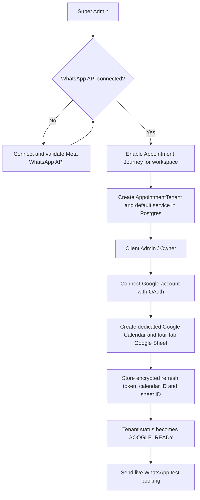
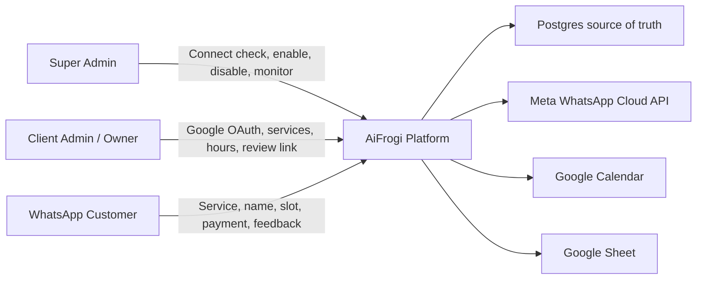
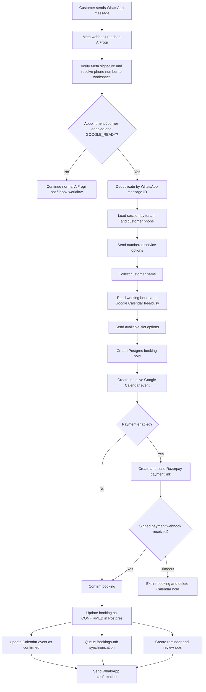
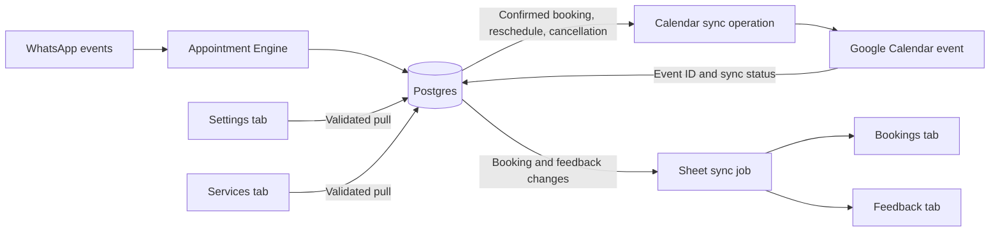

# Appointment Journey Flowchart

## 1. Product Activation And Setup

## 2. Roles And Responsibilities

| Role | Main controls |
| --- | --- |
| Super Admin | Verify WhatsApp connection, enable or disable Appointment Journey, initiate Google connection for legacy workspaces, monitor readiness. |
| Client Admin / Owner | Authorize Google, maintain services and working hours, view Calendar and Sheet, handle exceptions. |
| Customer | Start booking in WhatsApp, choose service and slot, pay when enabled, reschedule, cancel, and submit feedback. |

## 3. Real-Time WhatsApp Booking Workflow

## 4. Data Storage And Google Synchronization

### Google Sheet tabs

| Tab | Direction | Data |
| --- | --- | --- |
| Settings | Google Sheet to Postgres | Working hours, payment setting, review link. |
| Services | Google Sheet to Postgres | Service name, duration, price, active status. |
| Bookings | Postgres to Google Sheet | Customer, phone, service, slot, booking and payment status. |
| Feedback | Postgres to Google Sheet | Rating, comments, review routing and timestamps. |

## 5. Write Safety Rules

1. Postgres is always the source of truth.
2. Every inbound WhatsApp message is deduplicated by provider message ID.
3. Calendar events store their Google event ID on the booking record.
4. Sheet writes run asynchronously and never delay the WhatsApp reply.
5. Failed Google operations retry through deterministic jobs and retain the last error.
6. Disabling Appointment Journey immediately stops new appointment routing without deleting client data or Google credentials.

## 6. Current Implementation Boundary

Implemented now:

- Super Admin workspace enable and disable control.
- WhatsApp readiness enforcement and live Meta routing.
- Google OAuth, Calendar creation, Sheet creation, and encrypted token storage.
- WhatsApp service/name/slot conversation and Postgres booking persistence.
- Google Calendar free/busy lookup, event creation, and cancellation deletion.
- Google Sheet header initialization and Bookings-tab ledger appends.

Still required for the complete production workflow:

- Calendar reschedule updates and paid-hold promotion.
- Feedback tab synchronization.
- Settings and Services tab pull synchronization.
- Razorpay payment links/webhooks, reminder jobs, and review jobs.
- Per-client Meta Utility-template approval for confirmation, payment, reminders, and review requests.
