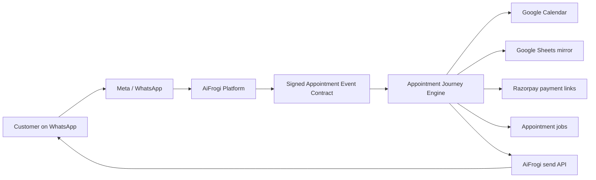

# Appointment Journey Product Brief

Source reviewed: `/Users/manishpurohit/Downloads/Appointment-Journey-Concept-to-Execution-2.pdf`
Review date: 2026-07-05
Status: Approved as a separate-product direction; implementation should begin with a narrow AiFrogi integration contract.

## Executive Decision

Appointment Journey should be built as a standalone WhatsApp appointment automation product, not as another generic workflow inside the current AiFrogi app.

AiFrogi should remain the owner of:

- WhatsApp/Meta connection, number onboarding, templates, billing access, inbox, and support.
- Webhook normalization and authenticated outbound send APIs.
- Tenant subscription lifecycle and add-on entitlement.

Appointment Journey should own:

- Appointment tenant configuration.
- Booking session state machine.
- Service catalog, working hours, slot calculation, holds, and confirmed appointments.
- Google Calendar, Google Sheets, and Razorpay integrations.
- Reminder, reschedule, review, hold-expiry, and sheet-sync jobs.
- Appointment-specific metrics and operator diagnostics.

This boundary keeps the product independently deployable and sellable while still using AiFrogi's WhatsApp distribution advantage.

## Review Verdict

The PDF is strong as a concept-to-execution spec. It already defines a clear customer, price, journey, state machine, integrations, roadmap, unit economics, and major risks.

The strongest choices are:

- WhatsApp-native journey with no web portal dependency for customers.
- INR 750/month price point tied to no-show reduction and review uplift.
- Google Calendar and Google Sheets as owner-facing tools instead of forcing a new dashboard.
- Tentative calendar holds before payment to reduce double-booking.
- Conversational v1 with WhatsApp Flows reserved for v1.1.
- Separate service contract with AiFrogi instead of deep coupling to the existing platform.

The main changes before build:

- Treat Postgres as source of truth and Sheets only as a mirror, never as runtime state.
- Do not build a visual automation builder for v1.
- Do not support multi-staff resource scheduling in v1.
- Make payment optional per tenant, because clinics, salons, lawyers, and trainers will adopt payments at different speeds.
- Finalize one signed payload contract between AiFrogi and the appointment engine before building the state machine.

## Fit With Current Repo

Current AiFrogi foundations that can be reused:

- `WhatsAppIntegration` and Meta send/webhook logic in `lib/services/whatsapp-service.ts`.
- Durable job pattern in `AutomationJob` and `lib/automation-engine.ts`.
- Workspace/organization, billing, support, and app-shell primitives.
- Existing inbound conversation and live-chat surfaces.
- Subscription gating and customer support runbooks.

Current gaps:

- No appointment-specific tenant, service, booking, session, or payment models.
- No Google OAuth, Calendar, Sheets, or Drive integration layer.
- No Razorpay webhook/payment-link lifecycle.
- Existing automation jobs are database-backed, while the PDF calls for Redis/BullMQ delayed jobs. For this repo, start with the current database-backed queue unless latency/scale requires BullMQ later.
- Existing WhatsApp webhook processing is not yet a clean normalized platform-to-product contract.

## Product Boundary

Use this product split:



Important rule: Appointment Journey can request WhatsApp sends, but it should not directly own Meta credentials or BSP-specific code.

## MVP Scope

Ship v1 with:

- Tenant provisioning from AiFrogi add-on subscription.
- Google OAuth connection.
- One calendar per tenant.
- Owner-editable services and working hours.
- Conversational WhatsApp booking flow:
  - idle
  - service select
  - collect name
  - slot select
  - awaiting payment, optional
  - confirmed
  - expired/cancelled
- Calendar free/busy slot generation for the next 7 days.
- 10-minute tentative hold.
- Optional Razorpay payment link and signed webhook.
- Confirmation, 24-hour reminder, 2-hour reminder, reschedule, and review request.
- Recommended WhatsApp Utility template pack from `docs/appointment-journey-whatsapp-templates.md`.
- Google Sheet mirror with Settings, Services, Bookings, and Feedback tabs.
- Human handoff back to AiFrogi inbox.
- Admin/debug view for tenant status, stuck sessions, failed jobs, and booking timeline.

Keep out of v1:

- Multi-staff calendars.
- Custom web booking pages.
- WhatsApp marketing broadcasts.
- Complex recurring classes.
- Full visual flow builder.
- Business-owned template editing.

## Contract To Finalize First

AiFrogi to Appointment Journey:

```json
{
  "tenant_id": "clinic_042",
  "customer_phone": "919876543210",
  "event_type": "text | button_reply | list_reply | flow_reply",
  "payload": {
    "text": "Hi",
    "reply_id": "slot_2026-07-08T10:30:00+05:30"
  },
  "message_id": "wamid.xxx",
  "timestamp": 1751702400
}
```

Requirements:

- HMAC signature header.
- One secret per environment.
- Idempotency on `message_id`.
- 200 response in under 200 ms.
- Async processing after acknowledgement.
- Engine must not depend on raw Meta webhook shape.

Appointment Journey to AiFrogi:

- `sendText`
- `sendList`
- `sendButtons`
- `sendTemplate`
- `handoffToInbox`
- `provisionTemplates`

Each outbound request needs:

- Tenant ID.
- Customer phone.
- Message type.
- Idempotency key.
- Reason/category for audit and cost attribution.

## Data Model Direction

Add these appointment-domain models separately from existing lead/campaign models:

- `AppointmentTenant`
- `AppointmentService`
- `AppointmentBooking`
- `AppointmentSession`
- `AppointmentMessageLog`
- `AppointmentPayment`
- `AppointmentJob`
- `AppointmentSheetSyncState`

Suggested status values:

- Booking: `HOLD`, `AWAITING_PAYMENT`, `CONFIRMED`, `CANCELLED`, `COMPLETED`, `NO_SHOW`, `EXPIRED`
- Payment: `NOT_REQUIRED`, `PENDING`, `PAID`, `FAILED`, `REFUNDED`
- Session: `IDLE`, `SERVICE_SELECT`, `COLLECT_NAME`, `SLOT_SELECT`, `AWAITING_PAYMENT`, `CONFIRMED`, `HANDOFF`

Add constraints:

- Unique active booking per tenant/slot/service for confirmed and hold states.
- Unique inbound message ID.
- Unique payment ID.
- Deterministic job keys: `{booking_id}:{job_type}`.

## Implementation Roadmap

### Phase 0 - Product Boundary

- Save this brief as the source implementation note.
- Agree whether Appointment Journey lives in this Next.js monorepo first or in a separate service repo from day one.
- Finalize the HMAC event and send API contract.
- Decide entitlement name, likely `APPOINTMENT_JOURNEY_750`.

Exit: AiFrogi can send a signed test event to a stub appointment endpoint and receive an acknowledgement.

### Phase 1 - Engine Foundation

- Add appointment domain models.
- Add tenant provisioning endpoint.
- Add signed AiFrogi webhook endpoint.
- Add pure state transition function and tests.
- Add session persistence with 30-minute expiry.

Exit: test WhatsApp event advances session state without calling Google or Razorpay.

### Phase 2 - Calendar Booking

- Add Google OAuth and encrypted refresh token storage.
- Add Calendar free/busy lookup.
- Add service duration and working-hours slot generation.
- Create, release, and promote calendar holds.

Exit: booking without payment creates a confirmed calendar event.

### Phase 3 - Payments And Jobs

- Add Razorpay payment-link creation.
- Add signed Razorpay webhook.
- Add hold-expiry, reminder, reschedule, review, and sheet-sync jobs.
- Re-read booking status before each job action.

Exit: paid booking promotes the hold, schedules reminders, and writes to the sheet mirror.

### Phase 4 - Design Partners

- Onboard 5 businesses.
- Run 72-hour soak test.
- Track no-show rate, booking completion, failed sends, stuck sessions, and review conversion.
- Add support/debug dashboard only for the operational states that actually appear.

Exit: 10 paying customers can be moved from design cohort to paid plan.

## Key Risks

- Google OAuth verification can block scale past 100 users. Start immediately.
- Template classification must stay utility-category; cost risk is material.
- Calendar race handling must be transactionally safe.
- Sheets must never block WhatsApp replies.
- Payment expiry versus payment success race needs row-level locking or equivalent transactional protection.
- Support load will rise if session recovery and handoff are weak.

## Recommendation

Start with a standalone Appointment Journey product inside the current repo only if speed is the priority. Keep the module boundary strict enough that it can later move to a separate service with minimal rewrite.

The first engineering task should not be UI. It should be the signed AiFrogi-to-Appointment contract, appointment tenant provisioning, and the pure booking state machine.

## 2026-07-05 Implementation Slice

Implemented the first executable product-boundary slice inside this repo:

- Added appointment-domain Prisma models for tenants, services, bookings, sessions, message logs, payments, jobs, and sheet sync state.
- Added signed Appointment Journey HMAC contract helpers.
- Added pure appointment state machine for conversational v1:
  - idle to service selection
  - service selection to name collection
  - name collection to slot selection
  - slot selection to hold plus either confirmation or payment wait
  - cancel and human handoff escape paths
- Added internal tenant provisioning endpoint: `POST /api/appointment-journey/tenants`.
- Added signed AiFrogi webhook endpoint: `POST /api/appointment-journey/webhook/aifrogi`.
- Added database-backed inbound processing that dedupes inbound messages, persists sessions, reserves outbound actions, and creates placeholder bookings without calling Google, Razorpay, or Meta directly.
- Added `npm run verify:appointment` for contract and state-machine acceptance.
- Added Google OAuth start/callback routes for the production redirect URI:
  - `GET /api/appointment-journey/google/oauth/start?tenantId=...`
  - `GET /api/appointment-journey/google/oauth/callback`
- Google OAuth callback stores the refresh token encrypted on the appointment tenant, creates a dedicated secondary Google Calendar, creates a four-tab Google Sheet, and stores both resource IDs.
- Settings > Integrations now shows a client-facing Appointment Journey card, connect/reconnect action, tenant status, booking counts, and Calendar/Sheet links.

Verification passed:

- `npm run verify:appointment`
- `npm run typecheck`
- `npm run lint` with existing warnings only
- `npm run build`

Next implementation slice:

- Add calendar free/busy/hold event operations behind the existing action reservations.
- Add Razorpay payment-link creation and signed webhook promotion.
- Add appointment job runner for hold expiry, reminders, review request, and sheet sync.
